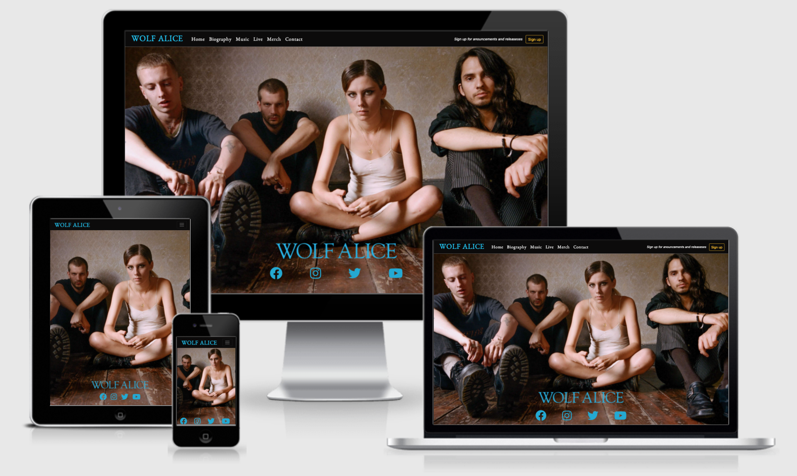

# Wolf Alice Official

## README

 

#### Project Goals/Target Audience

Wolf Alice Official is the bands most comprehensive web presence in terms of content and information. It is designed to be responsive and accessible on a wide variety of devices, ensuring it is easy to explore and navigate for all users. Wolf Alice Official is useful for fans both new and old to discover the latest releases, band history, upcoming shows, merchandise and discography.
    
The sites main purpose is to provide a hub of content/information to new and returning fans of the band. This is with the aim of increasing listeners across streaming services and producing higher sales of tickers/merchandise as a result. Second to this the site also provides clickthrough to social media, where users will be further exposed to the bands content/marketing. Signup for direct inbox updates and announcements is also provided to further submerse users in content. 
     
Wolf Alice official’s target audience is diverse in sense of background, age and qualifications, as music can be incredibly subjective. Though it is expected that the majority user bass will have an age range of between 15 and 45 years old. It can be inferred from this that both mobile and desktop responsiveness is essential. It also requires all content to be family friendly. 

 
 

 

## User Experience

### User Stories 

* First time Visitor Goals

  - As a First Time Visitor, I want to easily ascertain the main purpose of the site and learn more about the band and their history. 
   
  - As a First Time Visitor, I want to easily navigate the entirety of the site to find/discover content.
       
  - As a First Time Visitor, I want to look for their latest releases and where/how I can listen to them.
   
  - As a First Time Visitor, I wish to see exciting images and video to inform me on the bands visuals and aesthetic/style.
   
  - As a First Time Visitor, I wish to discover their social media channels, to gain further insight into the band themselves and the content they publish.
   
* Returning Visitor Goals
   
  - As a returning visitor I wish to find information about where the band are playing live and if I can attend.
   
  - As a returning visitor I want to know if there are any merchandise I can purchase and from where. 
   
  - As a returning visitor I wish to gain a more in-depth history of the band and how they began their journey.
   
* Frequent User Goals
   
  - As a frequent user, I want to check to see if there are any new releases or announcements.
   
  - As a frequent, I wish to know how to book the band for private functions and/or public events.
   
 * Business/Developer Goals
   
   - As a business, I want new users to discover the latest release from the band.
   
   - As a business, I want new users to clickthrough to streaming services and social media.
   
   - As a business, I want to be contacted about new bookings and potential events.
   
   - As a business I want returning users to purchase tour tickets.
   
   - As a business I want returning users to purchase merchandise.
   
   - As a business I want returning users to signup for announcements and releases.
   
   - As a business I want users to seek out the bands discography and listen.

## Design 

### Wireframes

The following wireframes were constructed within Balsamiq(link this) during the Scope Plane section of the design and planning stage for this project. They represent an early design concept that has largely been kept to through to final product. However do note that they vary slightly from the final design, this is due to practical considerations that arose during the surface plane stage.

[Homepage Dektop](assets/images/homepage-dektop.png)

[Homepage Tablet](assets/images/homepage-tablet.png)

[Homepage Phone](assets/images/homepage-phone.png)

[Biography Dektop](assets/images/bio-dektop.png)

[Biography Tablet](assets/images/bio-tablet.png)

[Biography Phone](assets/images/bio-phone.png)

[Music Dektop](assets/images/music-dektop.png)

[Music tablet](assets/images/music-tablet.png)

[Music Phone](assets/images/music-phone.png)

[Contact Dektop](assets/images/contact-dektop.png)

[Contact Tablet](assets/images/contact-tablet.png)

[Contact Phone](assets/images/contact-phone.png)

### Navigation Map 

This navigation map shows final navigational paths through the site. There are pages listed here that are external links only, this is due to time constraints on the project. 

[Site Map](assets/images/site-map.png)

### Colours 

The most prominent colours used are black, aqua blue, off-white and pale grey. Aqua blue is the colour of the Wolf Alice logo and thus fit the visual design. Note that the aqua blue used on various elements and the nav-bar is slightly brighter than the official logo, this is to increase contrast by design.

Background colours were chosen to contrast with images, icons and text as well as reduce eyestrain by being pale and not being overly bright shades. 

### Fonts

Roboto is the primary font for text on the site. This has been chosen due to it’s slightly curved design making it very easy to read at small sizes as well as large, great for responsiveness. A fallback font of Sans-serif has been set if for any reason Roboto is not displayed. Roboto was designed for use on the Android operating system and so is very compatible and fit for this purpose.

Benne is the font being applied to all headings and the navigation bar at the top of the site. This has been selected to as closely as possible match the official logo font for Wolf Alice. The continuity of the font across the sit has a very pleasing aesthetic effect and allows style to be applied without the sit feeling too “busy”. It is also a lightweight and clean font, responding well to smaller screen sizes.

### Icons/Links

Icons are used throughout the site in various fashions and are integral to the user stories and primary function of the site. Semantically placed the icons allow users to instinctively clickthrough from the site to desired destinations i.e. social media, streaming services.

Social media icons were used to display anchor tags linking to their related channels. The use of these highly recognisable and obvious icons allows any user to quickly access their preferred platform. This is again repeated with icons linking to related music streaming platforms, obvious icons are used for the user to select their relevant link. 

### Styling

The layout of the site uses a repeated customised bootstrap grid design behind all content across the pages. This continuity is pleasing and doesn’t confuse.

Album artworks and related information are held within containers, the information with a border. This boxed design is clean and sharp allowing a large amount of information to be displayed without confusing the user. The repeated design is logical and naturally invites the user to scroll down to reveal more. On smaller screen sizes the borders around text are removed to cater to reduces size, reducing any cluttered feeling and refreshing the design.

As part of the design, this boxed approach allows for easy maintenance and site updates in the future. New information and images need only be added to copied segments of code. This applies to related icons/links also. 

### Images

Aesthetics on a band site are imperative. Images are the best way to immediately imprint on the user and encourage them to stay. The full-width hero image on the home screen is stark, impactful and has been placed to cause intrigue. 

Album artworks are essential in the marketing of audio as they’re often the only images associated. The artworks on the site have been positioned and sized to offer a strong platter of contrast and colour. 

The image found on the Biography page has been chosen to relate to the frequently referenced live shows found in the biography text. 

### Backgrounds

An off white bass found to the sides is covered by a darker cloudy grey in the centre to enable a strong but unobtrusive background to overlay information.

## Video 

Wolf Alice’s latest single has been embedded via Youtube into the homepage, diversifying the type of content available to the user. This imbues a sense of immediate discovery for the new release and doesn’t require the user to leave the page. It is hoped that this immediate immersion in the music will increase conversions of visitors into customers of music/merchandise etc. It also delivers quickly an idea of who the band are artistically. 

## Features

* Existing Features 

### Navigation Bar

[Navbar](assets/images/navbar.png)

Featured on all pages of the site the navigation bar provides links to the Homepage, Biography page, Music page and Contact page. It also provides external links to tour dates and merchandise. 

It allows for fluent fuss free navigation of the whole site. 

The navigation bar is fully responsive and at larger screen sizes provides a sign up button for announcements and releases.  

### Homepage

[Homepage](assets/images/homepage.png)

The homepage provides an immediate sense of what the site is intended for with clear logos, a large full width hero image and links to social channels at the forefront. 

### Latest Release Section

[Latest Release](assets/images/latest-release.png)

Delivering business and user goals together the latest release section provides information on the latest release as well as links to relevant streaming platforms and a vinyl store. 

Eye catching artwork is position for user interest. 

### Music

[Music](assets/images/discography.png)

Utilising the same design found on the homepage but delivers the entire discography. Users are able to read information, track-lists and follow links to listen all from one page. 

### Biography 

[Biography](assets/images/bio.png)

Providing insight into the bands history the page is adorned with a large attention grabbing image that is related to the live shows referenced in the biography. 

### Contact

[Contact](assets/images/contact.png)

This page provides essential service to the band allowing potential clients to contact them directly about bookings for shows and other events.

### Footer

[Footer](assets/images/footer.png)

Unison across the site and fully responsive the footer provides social links on all devices and at larger sizes a homepage link and sign up button for announcements and releases.

* Additional Features 

  - Site is fully responsive

  - Contains interactive elements

  - Video media - youtube

  - Inter-page links for navigation

  - Signup modal

  - Links to external platforms

 - Features Left To Implement

    - Smooth link transition on homepage from hero image to release section

   - Page dedicated to video content of the band on youtube

   - Interactive hover buttons classes

## Technologies Used

- HTML
- CSS
- Javascript

## Frameworks, Libraries & Programs Used

- VS code 
  
    - Vs Code was used as the main editor for the project
   
- Bootstrap 4.2.1
  
    - Bootstrap was used to assist in the layout, styling and responsiveness of the site
   
- Git
  
    - Git was used for version control by utilising the Gitpod terminal to commit and push to Github
   
- Gitpod 
  
    - This was used a secondary editor when away from the main workstation
   
- GitHub
    - Used to store the projects code after being pushed from git
   
- Github desktop
  
    - Used to clone repositories from Github to local machine to work on
   
- Balsamiq
  
    - Used to create wireframes and plan design of site
   
- Fontawesome 5.15.3
  
    - Used to provide icons across the site 
   
- Google Fonts
  
    - Used to provide stylish and fitting fonts to the site
   
- jQuery
  
    - Provided with Bootstrap to enable certain responsive elements such as navbar 
   
- Jsdelivr
  
    - Provided with Bootstrap to enable certain responsive elements
   
- Popper.js
  
    - Provided with Bootstrap to enable certain responsive elements
   
- Tiny jpeg
  
    - Enabled compression of images to sizes more adequate for use on site

## Testing

### Validator Testing 

The entire site has been validated using the W3C Markup and W3C CSS validators. 

[Homepage](assets/images/homepage-val.png)

[Music](assets/images/music-val.png)

[Biography](assets/images/bio-val.png)

[Contact](assets/images/contact-val.png)

[CSS](assets/images/css-val.png)

### Testing User Stories from User Experience (UX) Section 

First Time Visitor Goals

- As a First Time Visitor, I want to easily ascertain the main purpose of the site and learn more about the band and their history. 

  - Upon entering the site users will immediately see the navigation bar, which clearly depicts the bands logo and pages that can be visited, including biography and music. 

  - The hero image and logo makes it very clear the site is about Wolf Alice

  - Following the navigation queues or scrolling with both lead to the discovery of more content 
   
- As a First Time Visitor, I want to easily navigate the entirety of the site to find/discover content.
  

  - The navigation bar is simplistic and intuitive to use, each new page offers content to discover.
   
- As a First Time Visitor, I want to look for their latest releases and where/how I can listen to them.

  - Upon entering the site, the logo can be clicked or the user can scroll, revealing the latest release and links to streaming platforms. 
   
- As a First Time Visitor, I wish to see exciting images and video to inform me on the bands visuals and aesthetic/style.

  - The hero image is eye catching and intriguing from the moment users enter the site.

  - Video is embedded into the homepage and album artwork is placed in such a way that it is unavoidable on the homepage. 

  - The music page has further artwork to view and is of a large size. 
   
- As a First Time Visitor, I wish to discover their social media channels, to gain further insight into the band themselves and the content they publish.

  - Social icons can be found on the hero image upon entering the site and also in the footer on every page. Allowing users to jump right to socials at a moments notice.

Returning Visitor Goals
   
- As a returning visitor I wish to find information about where the band are playing live and if I can attend. 
  - The navigation bar has a clear link labelled “Live”, which will show users every available date and location the band are playing. 
   
- As a returning visitor I want to know if there are any merchandise I can purchase and from where. 
  - The navigation bar has a clear link labelled “Merch” which will take them to the official store where all merchandise can be found. 
   
- As a returning visitor I wish to gain a more in-depth history of the band and how they began their journey.
  - The biography page can be found in the navbar and will lead the user to a descriptive history of the band beginnings. 

Frequent User Goals

- As a frequent user, I want to check to see if there are any new releases or announcements.
  - New releases can be found directly on the homepage, a signup options is available in the navbar and footer on large devices, alternatively in the navbar on small devices. 
     
- As a frequent user, I wish to know how to book the band for private functions and/or public events.
  - The contact page found in the navbar describes reasonable events and functions the band can be booked for, suppling a contact form to get in touch. 

Business/Developer Goals

- As a business, I want new users to discover the latest release from the band.
  - Upon entering the homepage the first thing visible once scrolling is the latest release section with  links and a youtube embed. 
                                                                               
- As a business, I want new users to clickthrough to streaming services and social media.
  - Streaming service icons and social icons are strategically placed on the site to almost never be off screen, reinforcing the route to clickthrough. 
   
- As a business, I want to be contacted about new bookings and potential events.
  - Users can get in contact via the contact page and form provided, anyone can contact. 
   
- As a business I want returning users to purchase tour tickets.

  - Linking from the navbar to the live section is seamless and easy.
   
- As a business I want returning users to purchase merchandise.
  - The merch section remains placed at the top of the page in the navbar and links directly to the official store. The vinyl icon also links to the store, increasing chances for sales. 
   
- As a business I want returning users to signup for announcements and releases.
  - Users may sign up on their first or last visit but the signup option is always clearly visible large devices and on small devices is included in the navbar. 
   
 - As a business I want users to seek out the bands discography and listen.  
   - The discography is easily accessible and contains links for each specific release to all relevant streaming platforms.  
  

## Further Testing 

### Black Box

Test No | Test Feature | Expected Result | Actual | Pass/Fail
------------ | ------------- | ------------ | ------------ | -------------
1 | Launch Site | Site loads homepage | PASS | Slight flicker, second load smooth (cached)|
2 | Check Navbar styling | Navbar styled correctly  | PASS | 
3 | Homepage images | Images in place | PASS | 
4 | Font, size and style | Styled correctly | PASS | 
5 | Intra-link | Links to latest release | PASS | 
6 | All site navbar links | All links function as expected | PASS | 
7 | Social icon links | Link to social platforms | PASS | 
8 | Streaming icon links | Link to streaming platforms | PASS | 
9 | Signup modal | Lauches onto page | PASS | 
10 | Contact Form | Loads as designed | PASS | 

### Browsers
 - The site was tested on Google Chrome, Edge, Safari and Mozilla Firefox
Lighthouse

### Lighthouse
 - Testing using lighthouse took place in chrome with these results link
After referring to the outcome and suggestions meta titles were added and these new improved results occurred link 

[Lighthouse Test 1](assets/images/lighthouse1.png)

[Lighthouse Test 2](assets/images/lighthouse2.png)

### Devices
 - The site was tested on a variety of devices including a MacBook Pro, Dell Desktop, iPhone 11, iPad and Samsung Galaxy S20.
  
### Friends/Family Users
 - Family members and friends took part in testing using the site and informed of any bugs encountered

### Known Bugs

 - On some mobile devices text can appear slightly off centre to the left
 
 - On Microsoft edge (intermittently) a thin white line appears between the footer and youtube embed 

## Deployment

### Github Pages

1. Log in to GitHub and locate the GitHub Repository
At the top of the Repository, locate the "Settings" Button on the option menu
 
2. Scroll down the Settings page until you locate the "GitHub Pages" Section
 
3. Under "Source", click the dropdown called "None" and select "Master Branch"
 
4. Press save.
    
5. Click the link now displayed.

### Forking the GitHub Repository 

Forking the Github repository makes a copy of the original repository on our GitHub account. We can then view and/or make changes without affecting the original repository.

1. Log in to GitHub and locate the GitHub Repository
 
2. At the top of the Repository locate the "Fork" Button
    
3. You should now have a copy of the original repository in your GitHub account

### Clone to desktop 

1. Donwload Github Desktop
    
2. Log in to GitHub and locate the GitHub Repository
    
3. Under the repository name, click "Clone to dektop".
    
4. Github dektop will ask you if you want to clone, click "Yes"
    
5. Click "Open in editor"
    
6. You have now cloned the project to your local machine

### Gitpod Clone

1. Download the gitpod chrome extension 
    
2. Locate the repository on Github 
    
3. On the righthand side of the menu bar choose "Gitpod"
    
4. Login to Gitpod using your Github account or make a new Gitpod account
    
5. You have now opened a new workspace within gitpod
    
6. The repository is clones to your Github 

ID | Filename.type | Description | Size | Location | Used
------------ | ------------- | ------------ | ------------ | ------------- | ------------
1 | index.html | Homepage | 14KB | Root | -
2 | biography.html | Biography Page | 15KB | Root | -
3 | music.html | Music Page | 19KB | Root | -
4 | contact.html | Contact Page | 12KB | Root | -
5 | wavoalartwork.jpeg | artwork | 12KB | images | music.html
6 | wamlicartwork.jpeg | artwork | 34KB | images | music.html
7 | wamlicartwork.jpeg | artwork | 34KB | images | music.html
8 | wabwartwork.jpeg | artwork | 303KB | images | index.html/music.html
9 | wahero2.jpg | hero | 726KB | images | index.html
10 | walogo.png | logo | 46KB | images | All
11 | walive3.jpg | image | 364KB | images | biography.html

## Credits

### Code

[Font Size Control](https://codepen.io/thecodercoder/pen/YzKgLYZ)

[Bootstrap4 Used throughout](https://getbootstrap.com/)

[Bootstrap navbar preset colour override](https://medium.com/wdstack/bootstrap-4-custom-navbar-1f6a2da5ed3c)

[Youtube embed](https://www.w3schools.com/html/html_youtube.asp)

[Alt text for background images](https://www.davidmacd.com/blog/alternate-text-for-css-background-images.html)

[How to use aria-labelledby](https://developer.mozilla.org/en-US/docs/Web/Accessibility/ARIA/ARIA_Techniques/Using_the_aria-labelledby_attribute)

[Img Center](https://stackoverflow.com/questions/10879955/how-to-align-an-image-dead-center-with-bootstrap)

[iframe boarder css](https://www.tagindex.net/css/frame/border.html)

[Correct form input fields](https://stackoverflow.com/questions/7497765/html5-valid-form-input-fields)

[meta-data descriptions](https://yoast.com/meta-descriptions/)

### Content 

[Visions of a Life info](https://en.wikipedia.org/wiki/Visions_of_a_Life)

[Blue weekend info](https://en.wikipedia.org/wiki/Blue_Weekend)

[My Love Is Cool info](https://en.wikipedia.org/wiki/My_Love_Is_Cool)

[Biography](https://www.rcarecords.com/artist/wolf-alice/)

[Guidance on use of fonts and simplistic design](https://www.30degreesnorth.com/blog/5-website-font-mistakes-you-dont-want-to-make)

### Media

[Hero images, logo, artwork (from press pack)](https://www.rcarecords.com/artist/wolf-alice/)

[Live image of band 1](https://commons.wikimedia.org/wiki/File:Wolf_Alice_(26563855519).jpg)

[Live image of band 2](https://www.flickr.com/photos/jeffkunz/45616040465/in/photolist-2cuW8Ai-2gNCWmq-292x9Fy-2jpKUr7-2cMGBfb-2cMGAPw-m1pU9Z-28DNKRo-2cuW7XK-m1qvUe-Ysfj2T-m1pV68-m1rpPC-Zpd7sN-2a2iu5g-2a2iwRi-Zpd7Vm-m1qwhi-CnjKWq-2a2ixzx-YsfjEr-Zpd6XQ-R4Sguj-CnjLZ7-2kfVA3g-5X9qN7-Ysfjsx-CnjL99-yNZt53-Zpd7hC-2ajhLnL-KEBQBu-Gtp6yX-29dT3yX-2kA44GS-bq8twV-YsfjD4-Zpd7Ly-yNZq7u-Ysfjhc-Fo4SvF-CnjLSo-Zpd6wQ-CnjLjQ-uWwJC6-2jovQxr-2gNCWjB-bGs3sF-oCNatx-CnjLvG)

## Ackhnowledgements
 - Patrick Justus 
 - Harlow College 
 - Code Institute 
